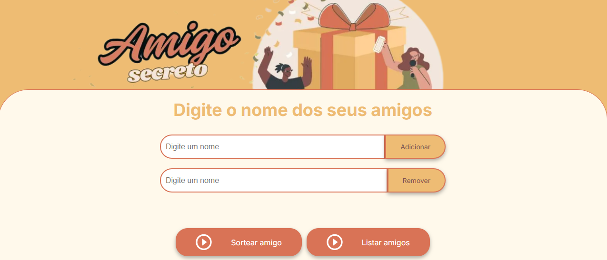

# Sorteio de Amigo Secreto

Bem-vindo ao projeto Sorteio de Amigo Secreto! 🎉 Esta aplicação permite que os usuários insiram nomes de amigos em uma lista e, em seguida, realizem um sorteio aleatório para determinar quem será o "amigo secreto". Este desafio faz parte do programa ONE, uma parceria da Alura com a Oracle.

# 🚀 Funcionalidades

✅ Adicionar nomes: Os usuários podem inserir o nome de um amigo em um campo de texto e adicioná-lo à lista ao clicar no botão "Adicionar".

✅ Remover nomes: Qualquer nome pode ser removido da lista ao clicar no botão "Remover" correspondente.

✅ Listar nomes: Os nomes atualizada aparecerá em um lista visível na tela ao clicar o botão "listar amigos".

✅ Validar entrada: Se o campo de texto estiver vazio, o sistema exibirá um alerta solicitando um nome válido.

✅ Sorteio aleatório: Ao clicar no botão "Sortear Amigo", um nome será selecionado aleatoriamente e exibido na tela como o amigo secreto sorteado. 🎲

# 🛠️ Tecnologias Utilizadas

- HTML → Estrutura da aplicação 🏗️
- CSS → Estilização e responsividade 🎨
- JavaScript → Manipulação da lista, validações e sorteio 🧠

Feito por Marcia Escolástico.
